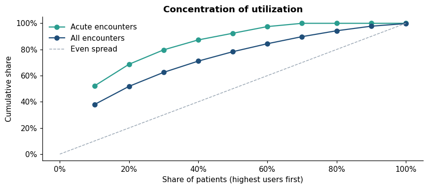

# Synthetic Patient Utilization & Outcomes Analysis

SQL and Python analysis of healthcare utilization in a synthetic patient population: who uses care, how much, where the cost sits, and what data-quality issues had to be handled first.

> **Synthetic data only.** Generated with [Synthea](https://github.com/synthetichealth/synthea). No real patient information or PHI.

## Key findings

From 1,034 synthetic patients and 39,902 encounters, 2017–2025:

- Patients 65+ averaged **74 encounters** versus **34** for ages 18–44, and more than twice the acute (ED + inpatient) care.
- The top 10% of acute users account for **52%** of all ED and inpatient encounters.
- Inpatient stays are **1.3%** of encounters but **11.6%** of synthetic cost.
- **29%** of inpatient episodes were followed by another acute encounter within 30 days.
- Within ages 45–64, chronic kidney disease is associated with **3.2×** the encounters and diabetes with **2.7×**.



Full write-up: [docs/executive_summary.md](docs/executive_summary.md)

## The notebook

Everything is in one notebook: **[patient_utilization_analysis.ipynb](patient_utilization_analysis.ipynb)**

| Part | What it covers |
|---|---|
| 1 · Load and validate | Loads six CSVs into SQLite, drops identifier fields, runs 20 data-quality checks grouped by dimension, and investigates what they flag |
| 2 · Profile | Coverage, categories, conditions and cost; sets the analysis rules and builds the clean views |
| 3 · Analysis | 14 questions from basic counts to window functions (`LAG`, `NTILE`, `DENSE_RANK`), with charts |
| 4 · Key findings | Five findings with numbers, and the data-quality decisions behind them |

## Approach

```
raw CSVs (unchanged) → load into SQLite → validate → profile → clean views → analysis → findings
```

The data-quality step shaped the results. Validation flagged 108 encounters dated after the patient's death; investigating showed every one was a **Death Certification** record that Synthea files as a wellness visit. They were excluded from all utilization counts. A 2021 volume spike was traced to COVID-19 vaccination encounters rather than treated as a trend.

## Skills demonstrated

SQL (joins, CTEs, subqueries, `CASE`, `HAVING`, window functions, date logic) · Python (pandas, sqlite3, matplotlib) · data validation · healthcare data (encounter classes, SNOMED CT, LOINC, RxNorm) · de-identification practice

## Reproduce

1. Download the Synthea CSVs (see [data/README_data_source.md](data/README_data_source.md)) into `data/raw/`.
2. `pip install pandas matplotlib jupyter`
3. Open the notebook and run all cells. Part 1 builds `data/synthea.db` from the CSVs.

## Limitations

Synthetic data; simulated costs compared within the dataset only; associations, not causation; the 30-day return measure is operational, not a CMS readmission rate.

## Coursework applied

| Certificate | Where it shows up |
|---|---|
| Databases and SQL for Data Science with Python (IBM) | Whole notebook: SQL run from Python via `sqlite3` and pandas |
| Introduction to Data Engineering (IBM) | Part 1: raw → loaded → validated pipeline, reconciliation, indexes |
| Healthcare Data Literacy (UC Davis) | [Data dictionary](docs/data_dictionary.md): table grain, code systems, field meaning |
| Healthcare Data Quality and Governance (UC Davis) | Part 1: checks by quality dimension, de-identification, documented exclusions |
| Analytical Solutions to Common Healthcare Problems (UC Davis) | Part 3: high utilizers, 30-day acute returns, chronic conditions |
